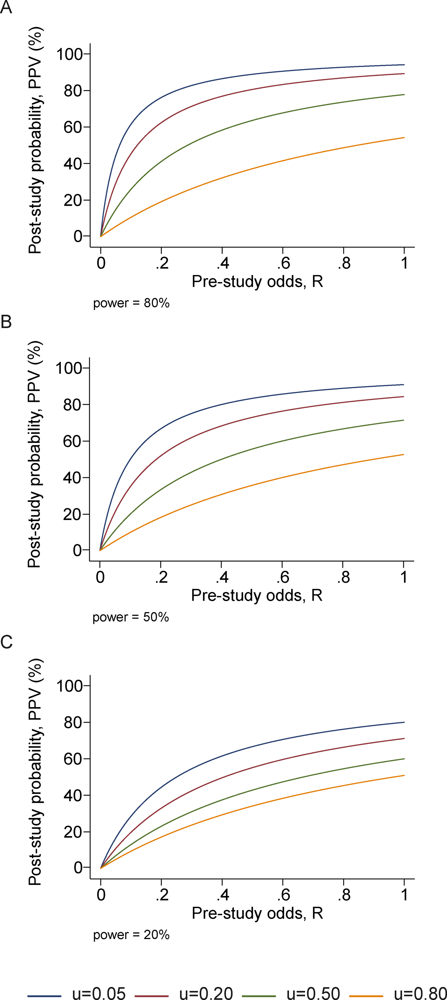
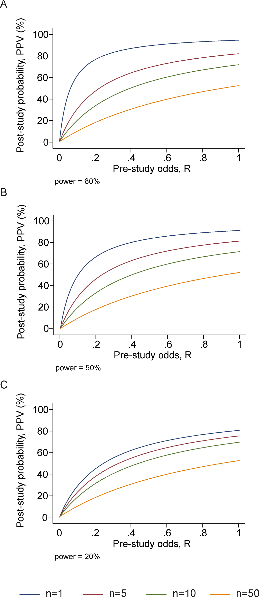
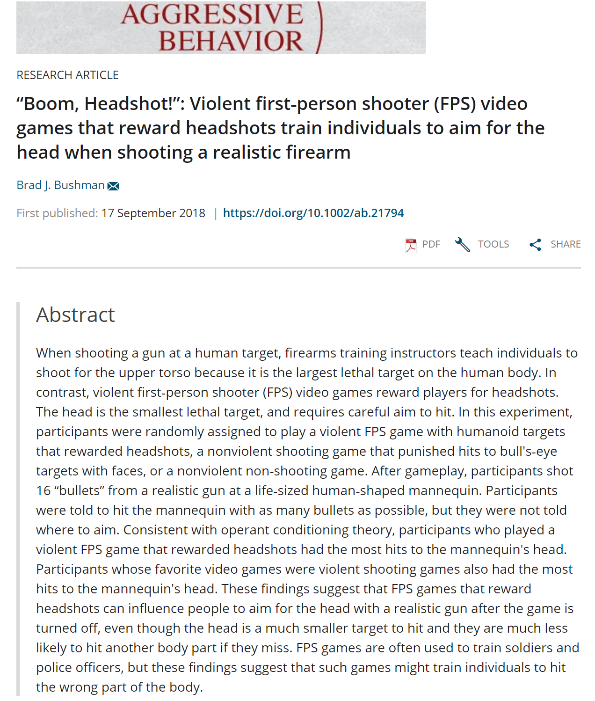

```{r setup, include=FALSE}
knitr::opts_chunk$set(echo = F,
                      message = F,
                      warning = F)
options(htmltools.dir.version = FALSE)
library(tidyverse)
library(RefManageR)
BibOptions(check.entries = T, 
           bib.style = "authoryear", 
           cite.style = "authoryear", 
           style = "markdown",
           hyperlink = T, 
           no.print.fields = "doi",
           dashed = F)
myBib <- ReadBib("references.bib", check = FALSE)

cite_this <- function(x) {
  cit <- Cite(myBib, x, .opts = list(cite.style = "authoryear"))
  return(cit)
}

```

class: center, middle

# Do you see the pattern?

```{r}
set.seed(42)
data.frame(x = sample(1:42, 100, T),
           y = sample(1:42, 100, T),
           z = sample(1:4, 100, T)^2,
           c = factor(sample(1:3, 100, T))) %>% 
  ggplot(aes(x, y, size = z, col = c)) +
  geom_jitter() +
  theme_void() +
  theme(legend.position = "none")
```

???
Are those blue dots larger?

Is there a concentration in the corner?

Is there a separate group?

No.  There's nothing.  The are random variables.  Any findings are by chance.  But if I continue to repeat generate these over and over I might eventually find something significant.

---

# Outline

--

#### Part I: Getting to know the problem
+ Why do we need replications?
+ Reported rates of replications

--

#### Part II: Understanding the problem
+ Statistical models for false findings
+ Large scale replications

--

#### Part III: Case studies
+ A famous study gets roasted
+ The effects of violent media and video game research on Jordan's attitudes

--

#### Part IV: Conclusion
+ Future directions
+ Questions

---
class: inverse, bottom

# Part I: Getting to know the problem 

---
class: center, middle

## Why do we need replications?

???

Why do we care about replication?

---
class: inverse


.double[Only experiments whose results can be repeated are considered genuine and reliable; in this way experimental repeatability serves as a kind of demarcation criterion between science and non-science]

~ Braude (2002, pp. 33)

???
Now this quote seems to be favorite of the COS but Braude - in the next paragraph - suggests that replicability is more of a "crude" demarcation criterion and throws at it criticism that really just seems to suggest that replication is a bit impractical in psychological research because of so many factors.  But of course, we are already aware of this problem and can't get around it.

--
, _ESP and Psychokinesis: A Philosophical Examination_ 

---
class: center

.double[Sanjay Srivastava]

.double[The Hardest Science]

???
`r cite_this("srivastava2009making")`
Sanjay Srivastava

+ Professor, University of Oregon
+ Director, Personality and Social Dynamics Lab
+ Blog: "The Hardest Science"
    - Hard -------- Soft
    - Physics ----- Psychology
    
Now psychology -- along with other social sciences -- might face an extra level of heat from this replication "crisis" but it doesn't mean it's unfairly tarted.
--


[xkcd 3 435 "Purity"](https://xkcd.com/435/)

---
## Functionality of replications

`r cite_this("schmidt2009shall")`

???
researcher agendas:  publication bias

Low quality: John Bohannon has published fake studies to demonstrate poor quality.  A manuscript by him and Adam Conover was accepted to one particularly awful journal that just contained the script to an episode of "Adam Ruins Everything" and clearly satirical tables and graphs.

p-hacking: FiveThirtyEight has provided a nice interactive application where you can mess around with variables until you find significant values

data manipulation and outright fraud: Keep this in mind -- we'll talk about it more in a bit

non-scientific reporting: this is more of an issue with public views but has contributed to the public reaction from the replication crisis

--
.large[
+ Verify hypothesis
{{content}}
]

--

+ Control for random chance from sampling error
{{content}}

--

+ Control for lack of internal validity
{{content}}

--

+ Control for fraud
{{content}}

--
+ Generalize results

???
Random chance from sampling error

Generalization here does not refer to conceptual replications, necessarily
---

## Arguments against

`r cite_this("pashler2012replicability")`

???

1) These assumptions are actually misleading and false.  In a few slides we'll look at some statistical modeling of false positive rates

2) Direct replications will test the validity of the findings -- the reproducibility.  Conceptual replications test for generalizability of a theory -- of an extension.  When a conceptual replication fails there are a variety of reasons we can point to -- such as failure to adhere more strictly to the original study -- rather than suggesting that the original study itself was not correct

3) Unfortunately this is not the case.  According to some models we'll look at later and results from replication studies the rate of failures would actually suggest that we see a much larger rate of retraction.  Andrew Wakefields retracted article linking the MRR vaccine to pervasive development disorder was published in 1998 and retracted 12 years later.  The actual rate of scientific retraction -- as far as I know -- hasn't been estimated.

--

### Statistical assumptions

--

+ Type I error: 5%
+ Power: 80%

--

### Types of replication

--

+ Direct replications are rare
+ Conceptual replications are more effective

--

### Self-correction

--

+ New studies push old
+ Bad studies will be forgotten

---
class: center, middle, inverse

.super[Estimated retraction rate?]

???
This comes from a PsycInfo search of the term "retracted" for the years 1980-2000 - thereby giving between 38-18 years for findings.

--

.super-duper[0.016% {{content}}]

--

*

---

## Replication rates psychology


`r cite_this("makel2012replications")`

???

Seems to be greater increase in the use of the term over the years

Rate of citations appear to be pretty decent; median citation rate for replications is 17 vs mdn for cited article 44 -- although this is a different, only 3 of the 100 journals had a 5 year impact factor higher than 17 -- suggests that replications aren't undervalued by researchers

Perhaps metrics such of these would help promote the publication of replications if they seem to be valued by researchers

--
.large[
+ 173,956 articles
{{content}}
]

--

+ 500 randomly samples for analysis

--

| Replication type | N    | % total| % success | % fail | % mixed |
|------------------|-----:|-------:|----------:|-------:|--------:|
| All              | 1861 | 1.07   | 78.9      | 9.6    | 11.4    |
| Direct           | 261  | 0.15   | 72.9      | 14.6   | 12.5    |
| Conceptual       | 1527 | 0.88   | 82.8      | 7.5    | 9.6     |


---
## Why don't replications occur?

--

.large[+ Time consuming
{{content}}
]

???

--

+ Resources draining
{{content}}
--

+ Publishers favor novelty
{{content}}
--

+ Small contributions
{{content}}
--

+ Career security
{{content}}
--

+ Practicality
{{content}}
--

+ Null findings
{{content}}

---

class: bottom, inverse

# Part II: Understanding the 'crisis'

---
class: middle, center

## Modeling false positives

"False-positive psychology"

---

### Positive Predictive Value

_.large[Why most published research findings are false]_

`r cite_this("ioannidis2005why")`

???

R: Ratio of the number of “true relationships” to “no relationships” among those tested in the field

PPV: positive predictive value

\mu: researcher bias
--

$$prestudy\ probability = \frac{R}{R + 1}$$
--

$$PPV = \frac{(1 - \beta)R}{R - \beta R + \alpha}$$
--

With bias:

$$PPV = \frac{(1 - \beta) R + \mu \beta R}{R  + \alpha - \beta R + \mu - \mu \alpha + \mu \beta R}$$

--

with n independent studies of equal power

$$PPV = \frac{( 1 - \beta^n)R}{R + 1 - (1 - \alpha)^n - R \beta^n}$$

---
### Positive Predictive Value

_.large[Why most published research findings are false]_

.pull-left[

]
.pull-right[

]

???
But hey, you want visuals don't you?

---
### Positive Predictive Value

_.large[Why most published research findings are false]_
.large[
+ Smaller studies
{{content}}
]

--

+ Smaller effect sizes
{{content}}
--

+ Greater number of tests and less pre-selection
{{content}}
--

+ Greater flexibility in methodology and analysis
{{content}}
--

+ Greater financial or other interest
{{content}}
--
+ <span style = "color:red"> _**Hotness**_ </span>

???

Hotness, or popularity, essentially leads to an increase necessity and time-sensitivity for publication.  It's beneficial to get our a positive finding as quick as possible and might even be _attractive_ to journals to put out a null study in contest with something _hot_ right now.

---
class: center, middle

## Large Scale replications

---

### Estimating the reproducibility of psychological research

`r cite_this("open2015estimating")`

???
Notes

--
.large[
- Center for Open Science
{{content}}
]
--

- 100 articles
{{content}}
--

- Direct replications
{{content}}
--

- Multiple labs

---
class: middle, center


---

class: middle, center, inverse

### 55 social psychology studies tested

???
Next slide: but these were single tests across a large number of studies.  What if we take the reverse and look at multiple tests across a few select studies?

--

### 14 replicated

--

.large[(`r paste(round(14 / 55 * 100, 2), "%", sep = "")`)]

---

### Investigating Variation in Replicability

_A "Many Labs" Replication Project_

`r cite_this("klein2014investigating")` 

???
Another collaboration with Brian Nosek.  13 studies were chosen from either classical studies with well-documented replicability, and contemporary studies with varied reports.

Studies were selected also for simplicity in design and were able to be conducted online

Currently no single standard -- 10 were clearly good on all or most accounts - one was questionable - and 2 were no good

--

.large[
+ 36 labs (25 US)
{{content}}
]

--

+ 6,344 participants
{{content}}
--

+ 13 studies - classic and contemporary
{{content}}
--

+ 10-11 successfully replicated


---
class: middle, center


???
+ Red lines are the .99 CI for non-central confidence intervals around the effects
+ Small circles are all of the effects
+ X are the original effects
+ Note How the strongest effects are found with Nobel Laureate Dr. Daniel Kahneman

---
class: center, middle

???
The brackets with underscores is slightly taken from my high school's year book my senior year.  My AP Literature class actually had a little fun poking at the existential themes of the cover.  But here I think it fits here because we have to make of this what we can, and determine how these results could impact Social Psychology -- and perhaps Psychology as a whole.  Really, I think I'm just happy that Kahneman's work here has been replicated.  We can still hold him high and tout about how a psychologist has won a Nobel prize.

--

.super-duper[[ ______ ]]

---
class: inverse, bottom

# Part III: Case studies

---
background-image: url(marshmallows.jpg)
background-size: 170% 100%

---

# The Marshmallow test

???
The main points that we take from the Marshmallow test

--

.large[
+ Walter Mischel
{{content}}
]

--

+ Funny YouTube videos
{{content}}

--

+ Self-control
{{content}}

--

+ Future success
    - SAT scores
    - Behavioral reports

---

# Revisiting the Marshmallow test

`r cite_this("watts2018revisiting")`  

???
Focus on mothers who did not complete college
+ Investigate if findings extend to relevant pop for policymakers concerned with developing interventions
+ Truncation in key gratification delay measure in college-edu sampled limited ability to reliability assess the correlation between grat delay and later abilities

--

### Criticisms

--

.large[
+ 653 participants study
{{content}}
]

--

+ 38--89 longitudinal 
{{content}}

--
+ Highly selective sample size: Stanford University community
{{content}}

--

+ No controls for possible confounds
    - Mother's education
    - SES
    - Home parenting environment
    
---
# Revisiting the Marshmallow test

--

### Replication overview

--

.large[
+ Conceptual replication
{{content}}
]

--
+ Marshmallow-like test
{{content}}

--
+ Historical database for achievement/life-success
{{content}}

--

### Replication results

--
.large[
+ Significance for achievement tests at 15
{{content}}
]

--
+ Insignificant for behavioral measures
{{content}}

--
+ Effects were smaller than previous
{{content}}

--
+ Effects further reduced when controlled for
    - Family background
    - Early cognitive ability
    - Home environment
    
---
background-image: url(marshmallow_roasting.jpg)
background-size: cover

---
class: center, middle

# Video games and violence


---

# Questionable research

.pull-left[

]

.pull-right[
## Jodie Whittaker

+ "Boom, Headshot!” Effect of Video Game Play and Controller Type on Firing Aim and Accuracy (2012)
]

???
Whoops! Wrong Doctor

Coincidentally, you can find a video from a TED talk which he begins by talking about the Marshmallow Study.  I don't have anything further on this.

---

# Questionable research

.pull-left[

]

.pull-right[
## Jodi L. Whitaker, Ph.D

+ "Boom, Headshot!” Effect of Video Game Play and Controller Type on Firing Aim and Accuracy (2012)
{{content}}
]

???
Arizona State University

For a timeline of events: http://www.malte-elson.com/headshot/

--

+ Data requests
{{content}}

--

+ OSU investigation
{{content}}
--

+ PhD revoked

---
# Questionable research

.pull-left[

]

.pull-right[
## Jodi L. Whitaker
+ "Boom, Headshot!” Effect of Video Game Play and Controller Type on Firing Aim and Accuracy (2012)

+ Data requests

+ OSU investigation

+ PhD revoked

{{content}}
]

???
And there the PhD is gone

But what advisor would allow this to happen?

--

+ Brad Bushman

{{content}}

--

+ Timeline of events: http://www.malte-elson.com/headshot/

---
class: middle, center



???

Looks like Brad really wanted to use that title.

This is a replication study, which was done after the original article was retracted.  Still, these articles are a bit misleading.  They report the finding that individuals who played violent video games had a greater number of "headshots" at a training mannequin than those who played non-violent shooters or entirely non-violent games.  There are two issues which limit the usefulness of these findings:

1) Participants were not instructed as to where to shoot at the mannequin.  The group with the violent shooter had a greater proportion of hits on the head and greater accuracy.  This is even more important because...

2) The violent video-game rewarded players for "headshots".  The game they used was Resident Evil (four?) where a headshot would kill the humanoid -- or really Zombie-like creatures.

Congrats, we see that participants, after playing a video game where the point is to shoot the head to survive, will be more likely to shoot a mannequin in the head and take better care aiming.

---
class: inverse, bottom

# Part IV: Conclusions

---

class: middle, center

# Where does this leave us?

---

background-image: url(color_272822.png)
background-size: 100% 52%
background-position: top
class: middle, center

<span style="color:#FFFFFF"> .super[Pessimistic meta-inductionism]</span><br></br>
  <br></br>
  <br></br>
  <br></br>
  <br></br>
.super[Epistemic optimism]

???

Pessimistic meta-inductionism is the notion that seeks to refute scientific realism -- if past, accepted theories, are found to be false, we have reason to doubt or disbelieve current theories.

The scientific realism of epistemic optimism reasons that what we know may not be entirely correct,  but the further we purse the Truth, the closer we get.

The current theories in which we hold are true, or approximately true

---

# Future Direction in Social Psychology

`r cite_this("begley2015reproducibility")`

.large[
+ Journals solicit replication bids
{{content}}
]
--
+ Emphasizing hypothesis testing
{{content}}

--
+ Improve statistical knowledge
{{content}}

--
+ Improve experimental methodologies
{{content}}

--
+ Systematic reviews
{{content}}

--
+ Replicability in training
{{content}}

--
+ Provide access to open data
{{content}}

--
+ Meta-analyses
{{content}}

--
+ Judge academics on quality, reproducibility, and sharing
{{content}}

--
+ Greater institutional responsibility

???
Begley and Ioannidis curate a list of suggestions and changes

---
class: center, middle, inverse

# End

---

# Selective references

.small[
```{r printbib, results = "asis", echo = FALSE, cache = FALSE}
PrintBibliography(myBib)
```
]

---
class: inverse
# Questions?

???
Brian Nosek might be a good example of how someone can start using the replication crisis to promote themselves.  Not in a bad way.  His concern and pro-activeness has put his name in the ring and he should be known for this.  Essentially, his research might be leaning into REPLICATIONS which should allow him to make a name for himself (and his university or the Center for Open Science).

Confirmation bias may play in greater role after the work has been done.  When researchers looks for literature they may be trying to find examples of studies that support their ideas -- rather than studies that don't.  Further, when the field is only filled with positive findings, finding those negative results will be more difficulty.  It's almost like a living form of confirmation bias where we don't even have access to the other side.

The previous slide provides some suggestions.  We can stress the importance of replications in research methods classes and research training; we can provide incentives to embark on replication efforts; hold bids for replication studies; award scholarships or grants for this issue; better track replication efforts by journals; and maybe even require

--

> What might be some factors or **incentives** that may begin to increase the amount of replication occurring across the field?

--

> To what extent do you think **Confirmation Bias** is impacting how often studies are reproduced? Does it seem plausible that some findings seem so correct and so important that other researchers may be finding the same results, just because they simply hope they will?

--

> One reason cited for the lack of replication is the **encouragement for novelty over replication**, which is often proposed by academics and publishers. How might this trend be explained using social influence principles? Furthermore, what suggestions would you propose to combat this growing systemic issue?

--

> What **incentives** can and should be built in order to promote replication? Is there a way to create value in replication studies?

