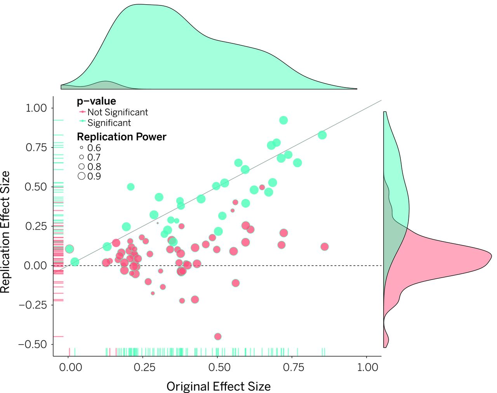
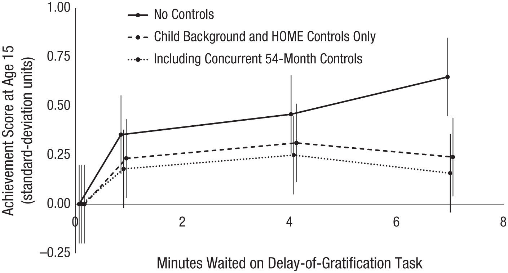

```{r setup, include=FALSE}
knitr::opts_chunk$set(echo = FALSE)
```

## Part I  

### General Background

- The replication "crisis"
- Center for Open Science (COS)
    - The reproducibility project
    - Estimating the reproducibility of psychological research


## Why?

 > Only experiments whose results can be repeated are considered genuine and reliable; in this way experimental repeatability serves as a kind of demarcation criterion between science and non-science

[@braude2002esp]


::: notes
Now this quote seems to be favorite of the COS but Braude - in the next paragraph - suggests that replicability is more of a "crude" demarcation criterion and throws at it criticism that really just seems to suggest that replication is a bit impractical in psychological research because of so many factors.  But of course, we are already aware of this problem and can't get around it.

Sanjay Srivastava at the University of Oregon: The "Hardest Science"
:::

## What is the replication "crisis"?

:::::::::::::: {.columns}
::: {.column}
- Suggestion of poor use of statistics
- Fabrication and falsifying [@fanelli2009many]
    - 2% of scientist report falsifying data 
    - 14% report colleagues
    - 72% of colleagues questionable practices
- *Epistemic optimism* and *pessimistic meta-inductionism*
- Current star: Brian Wansink
- 100 study replication [@open2015estimating] 
    - 97 originally significant results
    - 36 replicated with significant results
:::
::: {.column}
From Estimating the reproducibility of psychological research [@open2015estimating]

:::
::::::::::::::

::: notes
Statistics is fun but it's not for everyone.  If you have a question, ask someone.  Great theorists, clinicians, or experimenters don't need to be equally great statisticians.  But it does help. 

philosophical arguments
eo - that science present theories that are true or approximately true.  Through continued research and replication we may trim away at unnecessary parts of the theories and present something more well-founded.  Science essentially should be growing
pmi - argues that past scientific theories have been found to be false therefore current ones are likely to be as well

No scientific theory is infallible

BW: Cornell, Consumer Behavior and Market Research - approximately 17 papers retracted - resigning position
Issues with data manipulation, false and misleading reporting, and misuse of statistical analyses
:::


## Center for Open Science

:::::::::::::: {.columns}
::: {.column}

- Non-profit organization in Charlottesville, Virginia
- Openness, integrity, and reproducibility of scientific research
- Provide tools for managing and dissemination research
- Co-Founder: Brian Nosek

:::
::: {.column}

### The Reproducibility Project

- _Estimating the reproducibility of psychological science_ (2015) [@open2015estimating]
- Center for Open Science
- 2008 issues of journals 
    - *J Experimental Psychology*
    - *Learning, Memory, and Cognition*
    - *J Personality and Social Psychology*
- **Direct** replication

:::
::::::::::::::

::: notes
BN received his PhD under Mahzarin R. Banaji - works on Implicit Association
:::


## Estimating
:::::::::::::: {.columns}
::: {.column}



:::
::: {.column}

Findings

- 100 articles replicated across various teams
- 97 articles reported significant results
    - 36 of replicated articles found significant results
    - With data combined - 
- Replication success predicted by strength of original evidence

:::
::::::::::::::

::: notes
Studies that report strong effects are probably safe - but those with weaker effects should be taken with a bit more salt.
:::

## Why doesn't replication occur?

- **Universities**:  Publish or perish
- **Publishers**:  Prioritization of novelty over replication [@open2015estimating]
- **Researchers**:  "_We already know this_"

But it actually does...
- *Direct* replications are rare
- *Conceptual* or *Indirect* replications more frequent

::: notes
- But science isn't properly conducted with one instance of a phenomena
- A theory can be replicated conceptually by using other variables or procedures
- Indirect replications can be more closely linked to the original but confirm the existence of the phenomenon in another population or under another condition
:::


## Failures

- Original effect is false
- Replication produces false negative
- Effect is lower than reported
- Flawed design, implementation, or analysis
- Different methodologies

[@open2012open; @open2015estimating]

::: notes
Design of either original or replication
:::

## Part II

### Case studies

- The Marshmallow Test
    - Famous and well-known
    - Foundational principles
    - Issues with sample selection and size
    - Issues with other explanatory variables
- Video games and violence
    - Publication bias
    - Data concerns
    - Recent retractions

## Case Study 1: The Marshmallow Test

:::::::::::::: {.columns}
::: {.column}
- Walter Mischel
- Self control a key predictor for future success
- Original study included  653 pre-preschoolers
- Longitudinal study fewer
    - 38-89
    - Stanford University community
:::
::: {.column}

:::
::::::::::::::

::: notes
I've chosen this study because of its historical fame and the replication which was published this month.  This isn't to say that The Marshmallow Test is an instance in which we were *wrong* but serves as a solid, relevant example of the adaptation of science.
:::

## Conceptual Replication

:::::::::::::: {.columns}
::: {.column}

Revisiting the marshmallow test [@watts2018revisiting]

- Conceptual replication
- Marshmallow-like test
- Historical database for achievement/life-success
- Findings
    - Significance for achievement tests at 15
    - Insignificant for behavioral measures
    - Effects were smaller than previous
    - Effects further reduced when controlled for
        - Family background
        - Early cognitive ability
        - Home environment
:::
::: {.column}

:::
::::::::::::::

::: notes
Used child's own stated preference for food

Keep in mind that this is just one replication -- an indirect replication as well -- conceptual.  Children were not tested and followed but instead other measures of self-control were examined along with an historic database.  This is a conceptual replication: if self-control were a determinant of future success, we would see similar effects with verisimilar measures of self control and success.

This also serves as a good example of research in which findings would likely be without bias.  There is no "self-control" industry large enough to lobby for specific research so it's fairly safe to presume research in this field which is not additionally biased -- can't rule out typical pressures.
:::

## Case Study 2: Video game Violence

:::::::::::::: {.columns}
::: {.column}
- Violent video games induce
    - Violent behavior
    - Violent attitudes/thoughts
- Suppression pro-social behaviors
:::
::: {.column}

:::
::::::::::::::

::: notes
You may remember my ranting from earlier in the semester about Bushman and Anderson's article on video-game violence.  Well this rant will be shorter because I'm limited for time.  There 
:::

## Contemporary oppositions

Meta-analysis of publication bias [@ferguson2007evidence]

- Aggressive thoughts: 6 null studies required to produce trivial results
- Aggressive behavior: publication bias present
- Pro-social behavior: No bias
- Non-standardized measures (increasing)

Jodi Whitaker

- Former student of Brad Bushman
- PhD revoked

Papers retracted

- RETRACTED “Boom, headshot!”: Effect of video game play and controller type on firing aim and accuracy [@whitacker2014boom]
- RETRACTED The weapons effect [@benjamin2018weapons]
- RETRACTED Effects of violent media on verbal task performance in gifted and general cohort children [@cetin2016effects]
- REVISED Effects of weapons on aggressive thoughts, angry feelings, hostile appraisals, and aggressive behavior: A meta-analytic review of the weapons effect literature [@benjamin2018effects]
    

::: notes
There may be some inherent bias where Ferguson is a strong opponent to sensational research which finds correlation or causality of violence from video games.  However his approach tends to include literature review and meta-analyses.  Yet, just as researchers who seek to explore the connections, Ferguson is seeking to explore

JW: Bushman was cleared of wrongdoing - Several papers retracted - oh, and two of those she did not have involvement in...  The junior, female author was punished while the senior, male author was not...
:::

## Now what?

It's fine.  Psychology is fine.

- Pessimistic meta-inductionism vs Epistemic optimism
- Greater increase for transparency, openness, and replicability
- Emergence of groups dedicated to these principles
- Increased interest and use of open-source programs and data sharing
- Growing interest in null study publication
- Open access journals for public dissemination

::: notes
The Marshmallow Study may just be an example when a study becomes too famous

I'm not saying that the entire field of video game aggression and violence is up flawed, but it's not good when a well-known name in the field is associated with such a terrible event

I've been told before that some journals simply aren't as good as others.  Let's not forget that the Lancet published Wakefield's work and Science and Nature
:::

## References

