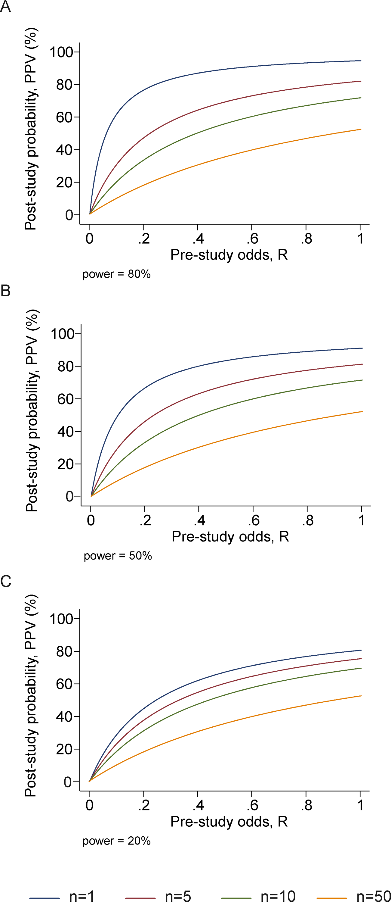
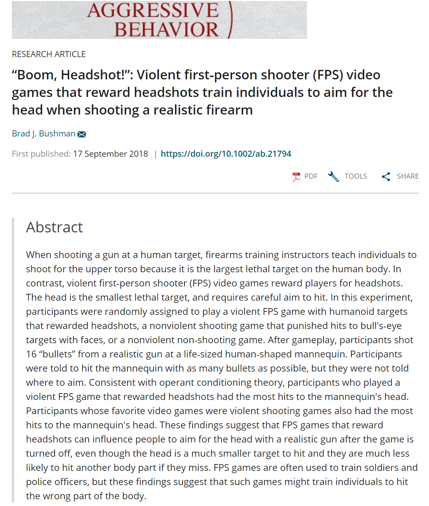

```{r setup, include=FALSE}
knitr::opts_chunk$set(echo = F,
                      message = F,
                      warning = F)
options(htmltools.dir.version = FALSE)
library(tidyverse)
library(RefManageR)
BibOptions(check.entries = T, 
           bib.style = "numeric", 
           cite.style = "numeric", 
           style = "markdown",
           hyperlink = FALSE, 
           dashed = FALSE)
myBib <- ReadBib("references.bib", check = FALSE)
```

class: center, middle

# Do you see the pattern?

```{r}
set.seed(42)
data.frame(x = sample(1:42, 100, T),
           y = sample(1:42, 100, T),
           z = sample(1:4, 100, T)^2,
           c = factor(sample(1:3, 100, T))) %>% 
  ggplot(aes(x, y, size = z, col = c)) +
  geom_jitter() +
  theme_void() +
  theme(legend.position = "none")
```

???
Are those blue dots larger?

Is there a concentration in the corner?

Is there a separate group?

No.  There's nothing.  The are random variables.  Any findings are by chance.  But if I continue to repeat generate these over and over I might eventually find something significant.

---
class:

# Outline

--

#### Part I: Getting to know the problem
- Why do we need replications?
- Reported rates of replications

--

#### Part II: Understanding the problem
- Statistical models for false findings
- Large scale replications

--

#### Part III: Case studies
- A famous study gets roasted
- The effects of violent media and videogame research on Jordan's attitudes

--

#### Part IV: Conclusion
- Future directions
- Questions
---
class: inverse, bottom

# Part I: Getting to know the problem 

---
class: center, middle

## Why do we need replications?

???

Why do we care about replication?

---
class: inverse


.double[Only experiments whose results can be repeated are considered genuine and reliable; in this way experimental repeatability serves as a kind of demarcation criterion between science and non-science]

~ Braude (2002, pp. 33)

`r Cite(myBib, "braude2002esp")`

???
Now this quote seems to be favorite of the COS but Braude - in the next paragraph - suggests that replicability is more of a "crude" demarcation criterion and throws at it criticism that really just seems to suggest that replication is a bit impractical in psychological research because of so many factors.  But of course, we are already aware of this problem and can't get around it.

--
, _ESP and Psychokinesis: A Philosophical Examination_ 


---
class: center

.double[Sanjay Srivastavas]

.double[The Hardest Science]

`r Cite(myBib, "srivastava2009making")`

???

Sanjay Srivastava

- Professor, University of Oregon
- Director, Personality and Social Dynamics Lab
- Blog: "The Hardest Science"
    - Hard -------- Soft
    - Physics ----- Psychology
    
Now psychology -- along with other social sciences -- might face an extra level of heat from this replication "crisis" but it doesn't mean it's unfairly targted.
--


[xkcd 3 435 "Purity"](https://xkcd.com/435/)

---
## Functionality of replications

`r TextCite(myBib, "schmidt2009shall")` `r Cite(myBib, "schmidt2009shall")`

+ Verify hypothesis

+ Control for random chance from sampling error

+ Control for lack of internal validity

+ Control for fraud

+ Generalize results

???
Random chance from sampling error

Generalization here does not refer to conceptual replications, necessarily

---
class: center, middle

## Reported rates

---

### Replication in psychology
`r Cite(myBib, "makel2012replications")`

- 173,956 articles
- 500 randomly samples for analysis
- Replication rate: 1.07%
    - All replications
        - 78.9% success
        - 9.6 fail
        - 11.4 mixed
    - Direct (14%)
        - 72.9% success
        - 14.6 fail
        - 12.5
    - Conceptual (81.9%)
        - 82.8
        - 7.5
        - 9.6

???

Seems to be greater increase in the use of the term over th eyears

Rate of citations appear to be pretty decent; median citation rate for replications is 17 vs mdn for citated article 44 -- although this is a different, only 3 of the 100 jounrals had a 5 year impact factor higher than 17 -- suggests that replications aren't undervalued by researchers

Perhaps metrics such of these would help promote the publication of replications if they seem to be valued by researchers

---
class: center, middle

## Research isn't perfect  

???
researcher agendas:  publication bias

Low quality: John Bohannon has published fake studies to demonstrate poor quality.  A manuscript by him and Adam Conover was accepted to one particularly awful journal that just contained the script to an episode of "Adam Ruins Everything" and clearly satirical tables and graphs.

p-hacking: FiveThirtyEight has provided a nice interactive application where you can mess around with variables until you find significant values

data manipulation and outright fraud: Keep this in mind -- we'll talk about it more in a bit

non-scientific reporting: this is more of an issue with public views but has contributed to the public reaction from the replication crisis

---

.larger[Researcher agendas
{{content}}]

--

Low quality publications
{{content}}
--

p-hacking
{{content}}
--

Data maniupuation
{{content}}
--

Poor data analytics
{{content}}
--

Outright fraud
{{content}}
--

Incentives to publish
{{content}}
--

Non-scientific _journalistic_ reporting
{{content}}
---

class: middle, center

## Scientific reporting

---
class: top, center

### "Scientific studies"

???
I want to take a moment and provide a bit more into the last bit.  Those that watched the John Oliver segement might have seen some of the following catchy headlines from poor journalistic reporting

--

Sugar might fuel the growth of cancer

--

Late night snacking could damage the part of your brain that creates and stores memories

--

Pizza is the most addictive food in America

--

Hugging your dog is bad for your dog

--

Drinking a glass of red wine is just as good as spending an hour at the gym

--

Liberals are better than conservatives at smizing

--

Your cat might be thinking about killing you

--

Smelling farts might prevent cancer

---
class: top, center, inverse

### "Scientific Coffee studies"

???
Special round just for coffee

--

Might reverse liver damage from booze

--

May help prevent colon cancer

--

May cut your risk for developing endometrial cancer

--

May raise miscarriage risk (in either parent)

---
class: top, center

### "Scientific studies"

???
And even more sketchy claims

--

Eating 30 grams of chocolate a day could improve blood flow to the placenta and benefit the growth and development of your baby

--

A women is more open to romance when they are "full" opposed to being hungry

--

Nothing up with açai berries
---

class: top, center

### "Scientific studies"

Eating 30 grams of chocolate a day could improve blood flow to the placenta and benefit the growth and development of your baby


A women is more open to romance when they are "full" opposed to being hungry


~~Nothing up with açai berries~~

???
Whoops -- That wasn't actually one of them.  That would be a good article but we don't really care about null findings.  Moving on!

--

Drinking champagne every week may delay dementia and Alzheimer's disease

--

Driving while dehydrated is just as dangerous as driving drunk

--

Having whole milk or whole fat dairy products can help you lose weight

--

Coffee, eggs, and wine are linked to lowering risk of cancer

--

Coffee, eggs, and wine are linked to raising risk of cancer

---
class: center, middle


???
No!  This is sensationism -- scientific reporting 


---

## Why don't replications occur?

.larger[Time consuming
{{content}}
]

???

Source: 10.1161/CIRCRESAHA.114.303819

Proposed 5 reasons - I've added 2 more

--

Resources draining
{{content}}
--

Publishers favor novelty
{{content}}
--

Small contribuitions
{{content}}
--

Career security
{{content}}
--

Practicality
{{content}}
--

Null findings
{{content}}
---

class: bottom, inverse

# Part II: Understanding the 'crisis'

---

## Modeling false positives

"Why most published research findings are false"
"False-positive psychology"

---

### Ioannidis (2005)

`r Cite(myBib, "ioannidis2005why")`

#### _Why most published research findings are false_

???

R: Ratio of the number of “true relationships” to “no relationships” among those tested in the field

PPV: positive predictive value

\mu: researcher bias
--

$$prestudy\ probability = \frac{R}{R + 1}$$
--

$$PPV = \frac{(1 - \beta)R}{R - \beta R + \alpha}$$
--

With bias:

$$PPV = \frac{(1 - \beta) R + \mu \beta R}{R  + \alpha - \beta R + \mu - \mu \alpha + \mu \beta R}$$

--

with n independent studies of equal power

$$PPV = \frac{( 1 - \beta^n)R}{R + 1 - (1 - \alpha)^n - R \beta^n}$$
---
### Ioannidis (2005)

#### _Why most published research findings are false_

.pull-left[

]
.pull-right[

]

???
But hey, you want visuals don't you?
---
### Ioannidis (2005)

#### _Why most published research findings are false_

Smaller studies

Smaller effect sizes

Greater number of tests and less preselection

Greater flexibility in methodology and analysis

Greater financial or other interest

<span style = "color:red"> _**Hotness**_ </span>

???

Hotness, or popularity, essentially leads to an increase necessity and time-sensitivity for publication.  It's beneficial to get our a positive finding as quick as possible and might even be _attractive_ to journals to put out a null study in contest with something _hot_ right now.
---

# Estimating the repoducibility of psychological research

`r Cite(myBib, "open2015estimating")`

???
Notes

--
.large[
- Center for Open Science
{{content}}
]
--

- 100 articles
{{content}}
--

- Direct replications
{{content}}
--

- Multiple labs
---
class: middle, center


---
class: middle, center, inverse

## 55 social psychology studies tests

--

## 14 replicated

---
class: inverse, bottom

# Part III: Case studies

---

.pull-left[
## Examining the impact of shotty and incomplete research
]

.pull-right[
### Historical study roasted

### Biased and questionable research
]

---
background-image: url(marshmallows.jpg)
background-size: 170% 100%
---

# The "Marhmallow test"

.larger[Walter Mischel]

--

.large[Self-control]

--

.large[Future success]


---

# Revisiting the Marshmallow test

--

.pull-left[

### Criticism

Participants

- Original study, 653

- Longitudinal, 38 to 89 

- Stanford University community
]

.pull-right[
{{content}}
]

--
Variables

- Mother's education

- SES
---
# Revisiting the Marshmallow test
.pull-left[
### Overview

- Conceptual replication

- Marshmallow-like test

- Historical database for achievement/life-success
]

.pull-right[
{{content}}
]

--
### Results

- Significance for achievement tests at 15

- Insignificant for behavioral measures

- Effects were smaller than previous

- Effects further reduced when controlled for
    - Family background
    - Early cognitive ability
    - Home environment
---
background-image: url(marshmallow_roasting.jpg)
backgroind-size: cover
---
background-image: url(boom_roasted.gif)
background-size: contain
---
.pull-left[

]
.pull.right[

]
---

# Video games and violence


---

# Questionable research

.pull-left[

]

.pull-right[
## Jodie Whittaker
+ "Boom headshot" article
{{content}}
]

???
Whoops! Wrong Doctor

Coincidentally, you can find a video from a TED talk which he begins by talking about the Marshmallow Study.  I don't have anything further on this.

---

# Questionable research

.pull-left[

]

.pull-right[
## Jodi L. Whitaker, Ph.D
+ "Boom headshot" article
{{content}}
]

???
Whoops! Wrong Doctor

For a timeline of events: http://www.malte-elson.com/headshot/

--

+ Data request
{{content}}

--

+ OSU investigation
{{content}}
--

+ PhD revoked

---
# Questionable research

.pull-left[

]

.pull-right[
## Jodi L. Whitaker
+ "Boom headshot" article

+ Data request

+ OSU investigation

+ PhD revoked
]

???
And there the PhD is gone

---
class: middle, center



???

Looks like Brad really wanted to use that title.

This is a replication study, which was done after the original article was retracted.  Still, these articles are a bit misleading.  They report the finding that individuals who played violent videogames had a greater number of "headshots" at a training mannequin than those who played non-violent shooters or entirely non-violent games.  There are two issues which limit the usefulness of these findings:

1) Participants were not instructed as to where to shoot at the mannequin.  The group with the violent shooter had a greater proportion of hits on the head and greater accuracy.  This is even more important because...

2) The violent video-game rewarded players for "headshots".  The game they used was Resident Evil (four?) where a headshot would kill the humaniod -- or really Zombie-like creatures.

Congrats, we see that participants, after playing a videogame where the point is to shoot the head to survive, will be more likely to shoot a mannequin in the head and take better care aiming.

---
class: inverse, bottom

# Part IV: Conclusions

---

class: middle, center

# Where does this leave us?

---

background-image: url(color_272822.png)
background-size: 100% 52%
background-position: top
class: middle, center

<span style="color:#FFFFFF"> .super[Pessimistic meta-inductionism]</span><br></br>
  <br></br>
  <br></br>
  <br></br>
  <br></br>
.super[Epistemic optimism]

???

Pessimistic meta-inductionism is the notion that seeks to refute scientific realism -- if past, accepted theories, are found to be false, we have reason to doubt or disbelieve current theories.

The scientific realism of epistemic optimism reasons that what we know may not be entirely correct,  but the further we purse the Truth, the closer we get.

The current theories in which we hold are true, or approximately true
---

# Future Direction in Social Psychology

--

.large[Replication
{{content}}]

--

Replication
{{content}}

--

Replication

---
class: center, middle, inverse

# End

---

# References
.small[
```{r printbib, results = "asis", echo = FALSE, cache = FALSE}
PrintBibliography(myBib, .opts = list(check.entries = F, sorting = "numeric", no.print.fields = c("doi")))
```
]
---

# Questions?

--

> What might be some factors or **incentives** that may begin to increase the amount of replication occurring across the field?

--

> To what extent do you think **Confirmation Bias** is impacting how often studies are reproduced? Does it seem plausible that some findings seem so correct and so important that other researchers may be finding the same results, just because they simply hope they will?

???
Brian Nosek might be a good example of how someone can start using the replication crisis to promote themselves.  Not in a bad way.  His concern and proactiveness has put his name in the ring and he should be known for this.  Essentially, his research might be leaning into REPLICATIONS which should allow him to make a name for himself (and his university or the Center for Open Science).

Confirmation bias may play in greater role after the work has been done.  When researchers looks for literature they may be trying to find examples of studies that support their ideas -- rather than studies that don't.  Further, when the field is only filled with positive findings, finding those negative results will be more difficulty.  It's almost like a living form of confirmation bias where we don't even have access to the other side.
